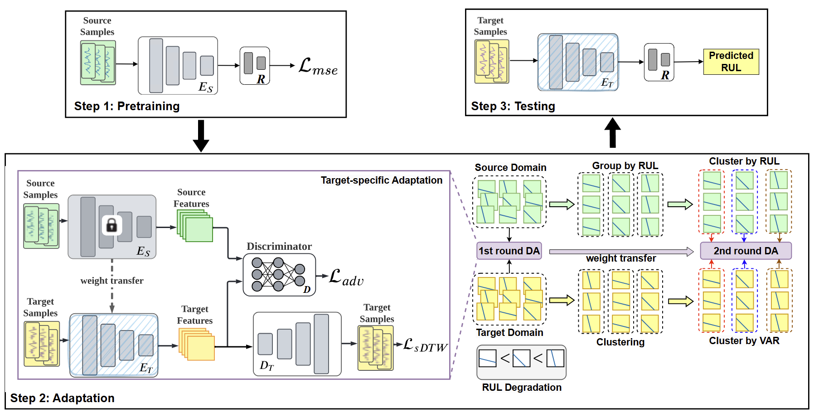

# Target-specific Adaptation and Consistent Degradation Alignment for Cross-Domain Remaining Useful Life Prediction [[Paper](https://ieeexplore.ieee.org/document/11095376)]
#### *by: Yubo Hou, Mohamed Ragab, Min Wu, Chee-Keong Kwoh, Xiaoli Li, Zhenghua Chen*
#### IEEE Transactions on Automation Science and Engineering (TASE-25).

This is a PyTorch implementation of this domain adaptation method for remaining useful life prediction on time series data.

## Abstract

Accurate prediction of the Remaining Useful Life (RUL) in machinery can significantly diminish maintenance costs, enhance equipment up-time, and mitigate adverse outcomes. Data-driven RUL prediction techniques have demonstrated commendable performance. However, their efficacy often relies on the assumption that training and testing data are drawn from the same distribution or domain, which does not hold in real industrial settings. To mitigate this domain discrepancy issue, prior adversarial domain adaptation methods focused on deriving domain-invariant features. Nevertheless, they overlook target-specific information and inconsistency characteristics pertinent to the degradation stages, resulting in suboptimal performance. To tackle these issues, we propose a novel domain adaptation approach for cross-domain RUL prediction named TACDA. Specifically, we propose a target domain reconstruction strategy within the adversarial adaptation process, thereby retaining target-specific information while learning domain-invariant features. Furthermore, we develop a novel clustering and pairing strategy for consistent alignment between similar degradation stages. Through extensive experiments, our results demonstrate the remarkable performance of our proposed TACDA method, surpassing state-of-the-art approaches with regard to two different evaluation metrics. 

## Requirmenets:
- Python3.x
- Pytorch==1.7
- Numpy
- Sklearn
- Pandas

## Datasets
### Download Datasets
We used NASA turbofan engines dataset
- [CMAPPS](https://catalog.data.gov/dataset/c-mapss-aircraft-engine-simulator-data)

### Prepare Datasets
- run_the data/data_preprocessing.py to apply the preprocessings.
- Output the data form each domain in tuple format train_x, train_y, test_x, test_y
- Put the data in the data folder

## Train the model
To pre train model:

```
python pretrain_main.py 
```
To train model for 1st round domain adaptation:

```
python main_cross_domains.py     
```

To train model for 2nd round domain adaptation:

```
python main_cross_domains_two_step.py     
```

## Citation If you found this work useful for you, please consider citing it. 
```
@ARTICLE{11095376,
  author={Hou, Yubo and Ragab, Mohamed and Wu, Min and Kwoh, Chee-Keong and Li, Xiaoli and Chen, Zhenghua},
  journal={IEEE Transactions on Automation Science and Engineering}, 
  title={Target-specific Adaptation and Consistent Degradation Alignment for Cross-Domain Remaining Useful Life Prediction}, 
  year={2025},
  volume={},
  number={},
  pages={1-1},
  doi={10.1109/TASE.2025.3590839}}
```


